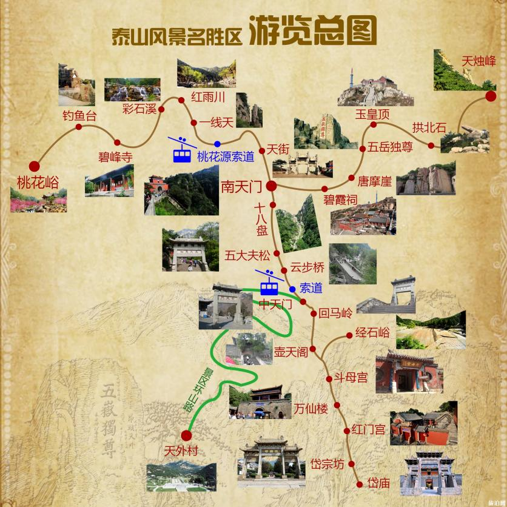

-----

| Title     | 泰山                                             |
| --------- | ---------------------------------------------- |
| Created @ | `2023-04-22T03:38:35Z`                         |
| Updated @ | `2023-04-23T14:24:51Z`                         |
| Labels    | \`\`                                           |
| Edit @    | [here](https://github.com/junxnone/t/issues/2) |

-----

# 泰山

## 路线

  - 主要有 4 条路线
      - 红门路线(5:00 - 24:00)
      - 天外村路线 (乘车 6:00 - 21:00)
      - 桃花峪路线 (乘车 8:00 - 17:00，步行 9:00 - 16:00)
      - 天烛峰路线 (xx)
  - [Google Earth 3D
    视角](https://earth.google.com/earth/d/1Uzx2YoF0071ZMz52f21MHlSesddkBZjt?usp=sharing)

