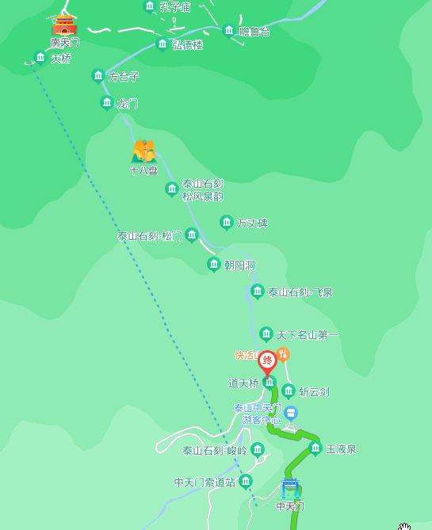
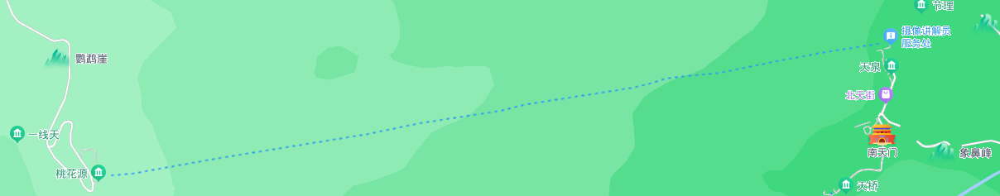
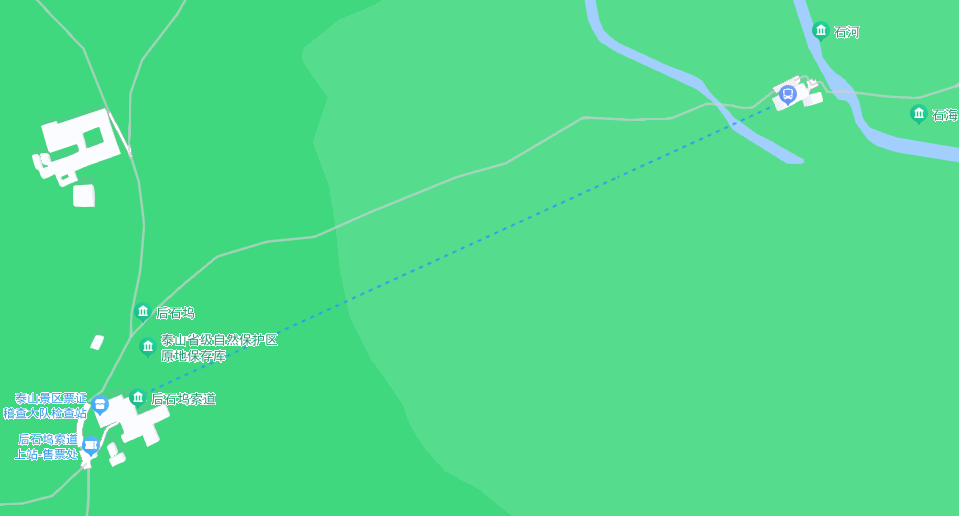

-----

| Title     | 泰山 索道                                          |
| --------- | ---------------------------------------------- |
| Created @ | `2023-04-22T04:17:05Z`                         |
| Updated @ | `2023-04-22T14:43:16Z`                         |
| Labels    | \`\`                                           |
| Edit @    | [here](https://github.com/junxnone/t/issues/3) |

-----

# 泰山索道

  - 泰山有 3 条索道，每条进山道路都能在中途乘坐索道到达山顶
  - 泰山索道票当日有效，线上线下均只出售当天的索道票。

## 中天门索道 \[中天门 - 南天门\]

  - 红门路线 & 天外村路线
  - 单程 ¥100 `@2023.04`
  - 营业时间:
      - **6:30 - 17:30:** 4 - 10 月
      - **8:00 - 17:00:** 11 - 3 月
  - 全长2089米
  - 单线循环脱挂式8人吊厢索道
  - 单程运行时间 8 - 15分钟

## 桃花源索道 \[桃花源 - 南天门\]

  - 桃花峪路线
  - 单程 ¥100 `@2023.04`
  - 营业时间:
      - **6:30 - 17:30:** 4 - 10 月
      - **8:30 - 16:00:** 11 - 3 月
  - 全长2176
  - 单线循环脱挂式八人吊箱索道
  - 单程运行时间 8 - 15分钟

## 后石坞索道 \[石河石海 - 后石坞\]

  - 天炷峰路线
  - 常因森林防火原因关闭，需提前咨询景区官方
  - 单程 ¥20 `@2023.04`
  - 全长518米
  - 单线循环脱挂式双人吊椅索道
  - 两站高差172.40米

## 参考

  - [泰山索道公告](http://www.tssd.org.cn/phone/channels/4.html)
