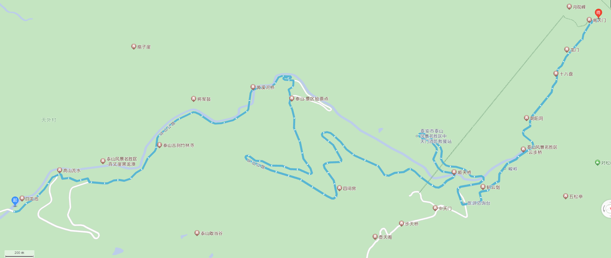

-----

| Title     | 泰山 路线 天外村路线                                    |
| --------- | ---------------------------------------------- |
| Created @ | `2023-04-22T04:29:26Z`                         |
| Updated @ | `2023-04-23T15:15:40Z`                         |
| Labels    | \`\`                                           |
| Edit @    | [here](https://github.com/junxnone/t/issues/4) |

-----

# 天外村路线(乘车第一选择路线)

  - 坐车从天外村到中天门约 15KM - 30分钟(省时/节省体力)
  - 景区封闭管理, 私家车需在此处换乘专线旅游车
  - 中天门 - 南天门 (登山/索道)

## 沿途景点

  - 龙潭水库
  - 白龙池
  - 黑龙潭
  - 竹林寺
  - 黄溪河水库
  - 扇子崖
  - 傲徕峰
  - 中天门
  - ...... (同红门路线)
  - 南天门
