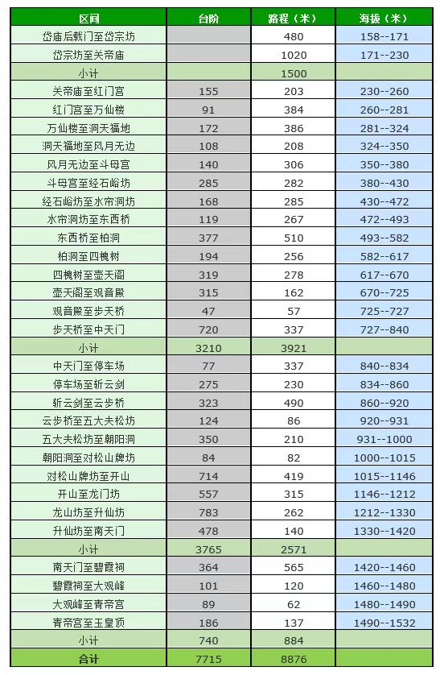

-----

| Title     | 泰山 路线 红门路线                                     |
| --------- | ---------------------------------------------- |
| Created @ | `2023-04-22T04:29:28Z`                         |
| Updated @ | `2023-04-23T15:15:34Z`                         |
| Labels    | \`\`                                           |
| Edit @    | [here](https://github.com/junxnone/t/issues/5) |

-----

# 红门路线(推荐步行路线)

  - 人文和自然景观最集中的经典登山线路
  - 历朝皇帝封禅皆为此处登山，所以也被称为泰山御道

## 沿途景点

  - 红门宫
  - 万仙楼(售票处)
  - 斗母宫
  - 经石峪
  - 壶天阁
  - 回马岭
  - 中天门(索道下站)
  - 快活三里
  - 云步桥
  - 五大夫松
  - 十八盘
  - 南天门
  - 天街
  - 碧霞祠
  - 唐摩崖
  - 五岳独尊
  - 玉皇顶
  - 拱北石

## 里程表

