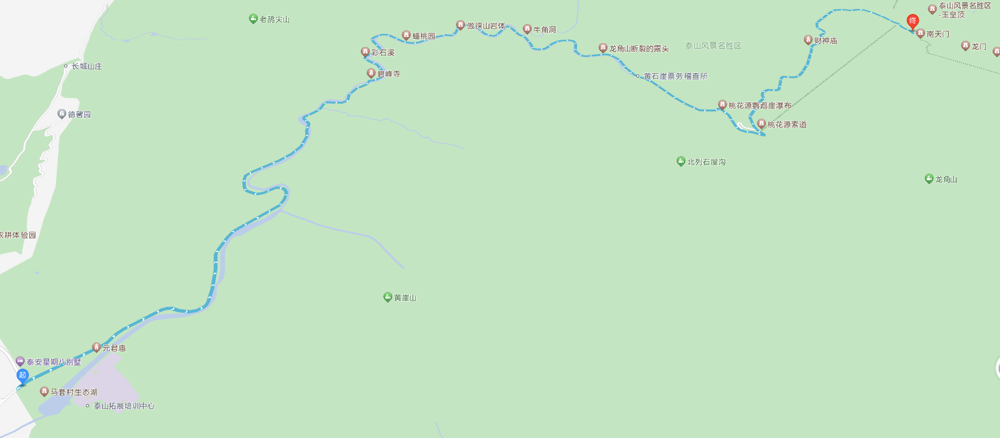

-----

| Title     | 泰山 路线 桃花峪路线                                    |
| --------- | ---------------------------------------------- |
| Created @ | `2023-04-22T05:26:29Z`                         |
| Updated @ | `2023-04-23T15:15:46Z`                         |
| Labels    | \`\`                                           |
| Edit @    | [here](https://github.com/junxnone/t/issues/6) |

-----

# 桃花峪路线

  - 距离市区较远, 适合自驾游客
  - 适合春天桃花盛开时游览

## 沿途景点

  - 钓鱼台
  - 碧峰寺
  - 彩石溪
  - 赤鳞溪
  - 红雨川
  - 桃花源索道
