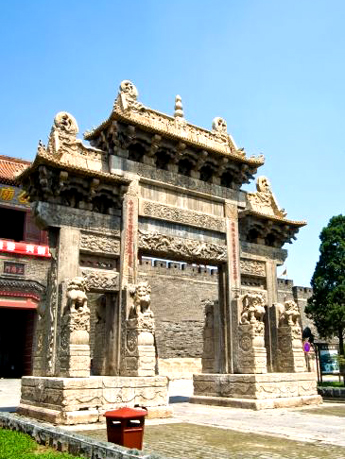
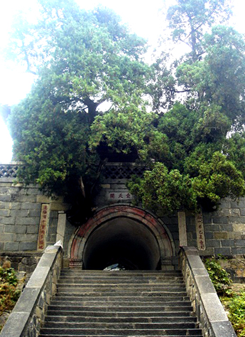
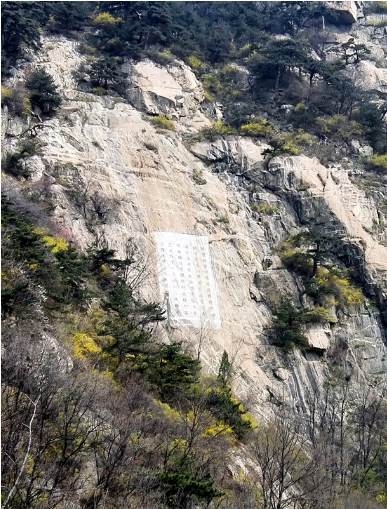
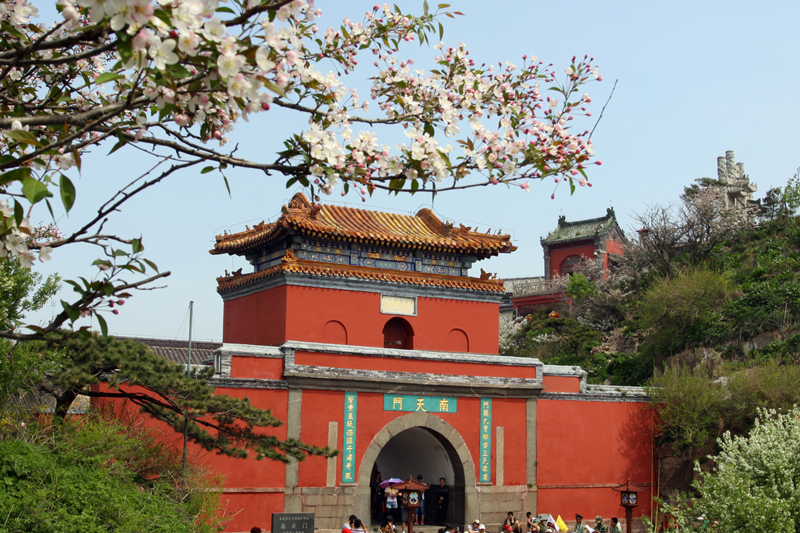

-----

| Title     | 泰山 景点 石刻 题诗题联                                   |
| --------- | ----------------------------------------------- |
| Created @ | `2023-04-23T15:34:46Z`                          |
| Updated @ | `2023-04-23T15:41:11Z`                          |
| Labels    | \`\`                                            |
| Edit @    | [here](https://github.com/junxnone/t/issues/17) |

-----

# 题诗题联石刻

## 岱庙坊对联石刻

“峻极於天，赞化体元生万物；帝出乎震，赫声濯灵镇东方。”“为众岳之统宗，万国具瞻，巍巍乎德何可尚；撡群灵之总摄，九州待命，荡荡乎功孰于京。”岱庙坊又名东岳坊。位于岱庙正阳门外，坊南为遥参亭。坊创建于清康熙7年至16年间，全石建筑。气势宏伟，雕工精细，是泰山唯一瑰丽的石雕建筑。

## 孔子登临处坊联

“素王独步传千古，圣主遥临庆万年。”位于一天门北，明代嘉靖三十九年（1560）山东巡抚朱衡等建。全石建筑，古朴肃穆，藤萝盘绕，松柏掩映，为登山初阶之佳景。

## 壶天阁联

“登此山一半已是壶天，造极顶千重尚多福地。”“壶天日月开灵境，盘路风云入翠微。”壶天阁位于回马岭下，创建于明代嘉靖年间，名“升仙阁”。清代乾隆十二年（1747）重修后改称“壶天阁”。相传海上有三山，其形如壶，方丈曰方壶，蓬莱曰蓬壶，瀛州曰瀛壶，均为神仙居住，称仙山。壶天阁四面环山，风景非凡，若壶中之天，犹如“壶天仙境”。

## 乾隆朝阳洞诗碑（万丈碑）

“迥峦抱深凹，曦光每独受。所以朝阳名，名山率常有。是处闢云关，坦区得数亩。结构寄幽偏，潇洒开窗牖。历险欣就夷，稍息复进走。即景悟为学，无穷戎株守。”清高宗弘历于乾隆十三年（公元1748年）登泰山时御题的一首五言古诗，镌刻在朝阳洞东的御风崖上。字径3尺，俗称“万丈碑”。诗文共6行，满行12字，行书体。

## 南天门联

“门辟九霄仰步三天胜迹，阶崇万级俯临千嶂奇观。”南天门创建于元代中统五年（1264），门若洞穴，上有“摩空阁”，重檐凌空，气势宏伟。
