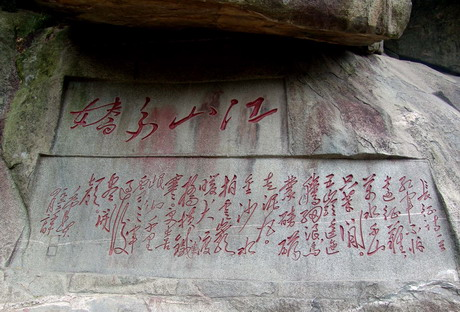
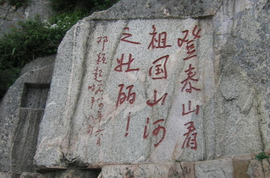
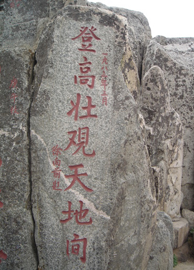
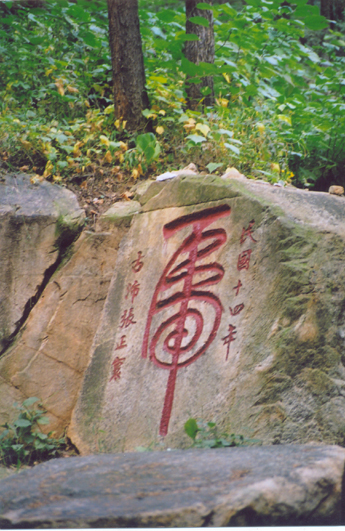
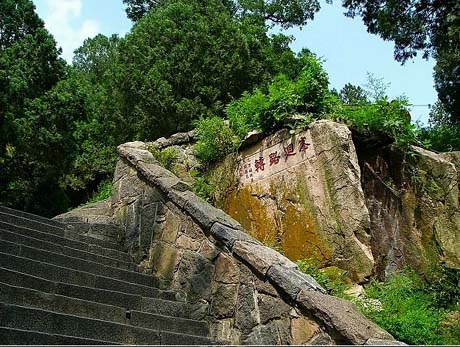

-----

| Title     | 泰山 景点 石刻 题记题名                                   |
| --------- | ----------------------------------------------- |
| Created @ | `2023-04-23T15:40:21Z`                          |
| Updated @ | `2023-04-23T15:40:21Z`                          |
| Labels    | \`\`                                            |
| Edit @    | [here](https://github.com/junxnone/t/issues/18) |

-----

# 题记题名石刻

## “江山多娇”题刻

位于云步桥南。摩崖高120厘米，宽315厘米，字径62×70厘米，系泰安市文物风景管理局于1983年据毛泽东手迹刻制，草书体。

## 邓颖超题词石刻

位于岱顶天街东首。摩崖高150厘米，宽130厘米，大字径25厘米，系邓颖超于1984年6月登岱时题书，泰安市文物风景管理局刻制，此内容同时刻制了一通碑，立于岱庙汉柏院中。

## 彭真题词石刻

位于岱顶天街东。摩崖高260厘米，宽70厘米，大字径55×42厘米。系彭真于1985年题书，泰安市文物风景管理局刻制。行书体。

## 徐向前题词石刻

位于玉皇顶盘路东，摩崖高220厘米，宽55厘米，大字径23×25厘米，系徐向前元帅于1983年3月题书，泰安市文物风景管理局刻制。楷书体。

## “如”字题刻

位于云步桥南，摩崖高45厘米，宽110厘米，系辛酉年（公元1921年）春三月，李和谦游山乐题。大字径20×50厘米，草书体。

## “风月无边”题刻

位于斗母宫南的盘路侧。摩崖高60厘米，宽150厘米，大字径34×22厘米，系清己亥年（公元1899年）夏，历下才子刘廷桂题书。此题刻实际上是个拆字游戏，它是由“风月”二字拆去边框所得，暗喻此处“风月无边”。

## “虎”刻石

位于斗母宫南，摩崖高120厘米，宽80厘米。大字径106×46厘米。系民国十四年（公元1925年），古沛张正寰题书，草书体。

## “峰廻路转”题刻

位于药王殿南，摩崖高42厘米，宽128厘米，大字径23×20厘米，系乙酉姑洗月上濣，历邑刁文元题书。楷书体。
